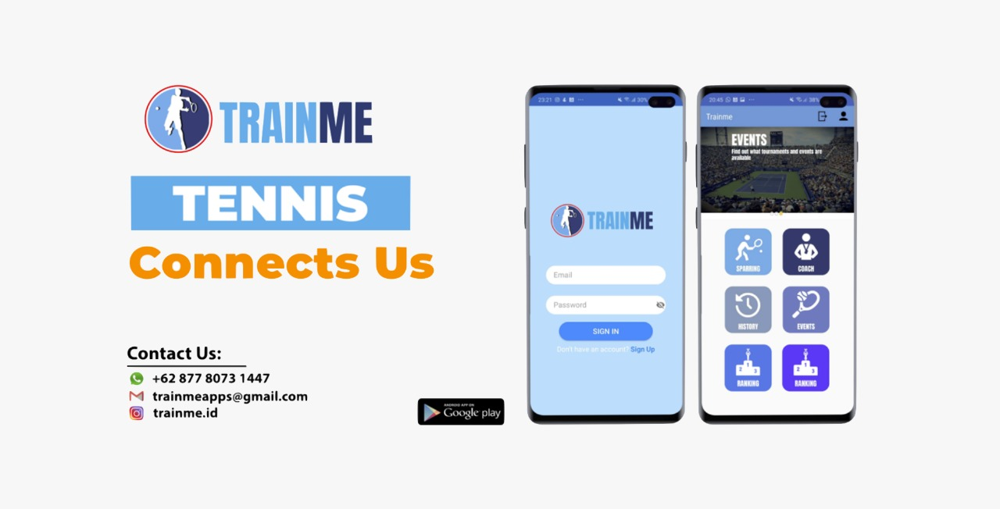

# Trainme: Android

Google play store: https://play.google.com/store/apps/details?id=com.trainme.jerald.frontend&hl=en

TRAINME was created to provide a platform to facilitate tennis enthusiasts especially students more readily access sparring partners, coaches, tennis events and information on players’ level like National Ranking. Being tennis players ourselves, we noticed the difficulty of tennis students in accessing affordable coaches (and also vice versa) in the Indonesian tennis community, which may be a leading reason for the lack of professional tennis players from Indonesia progressing to the highest levels in world tennis currently. We also observed that within the tennis community, there are many young tennis enthusiasts who are ambitious to progress to higher levels and there is no lack of capable and experienced tennis coaches within Indonesia who potentially could
help them.

In the TRAINME app, we have the following objectives:
- Users can locate and book appointments with sparring partners/coaches.
- Coaches and sparring partners can post their profiles to enable users to contact and book sessions.
- Access to National Rankings of players and other rating systems
- Access to list of tournaments and other tennis events on the calendar
- Features to allow for other sports will be rolled out in the future

In conclusion, whether it is for a junior tennis player ambitiously trying to make the Grand Slam some day, or a coach passionately wanting to make that happen or even simply an avid social player wanting to increase playing opportunities, this app intends to further enhance tennis activities at all levels for the tennis community here in Indonesia.
